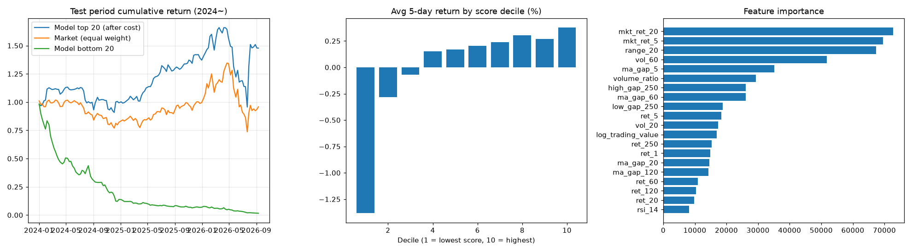
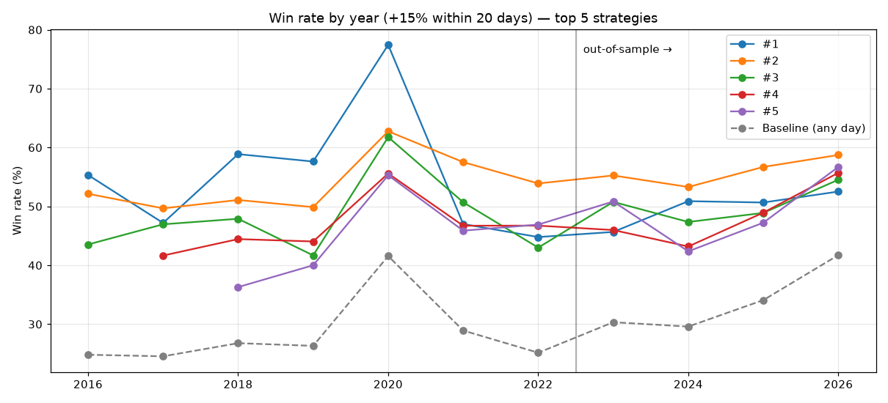
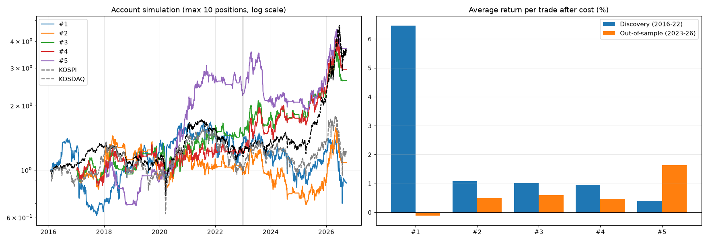
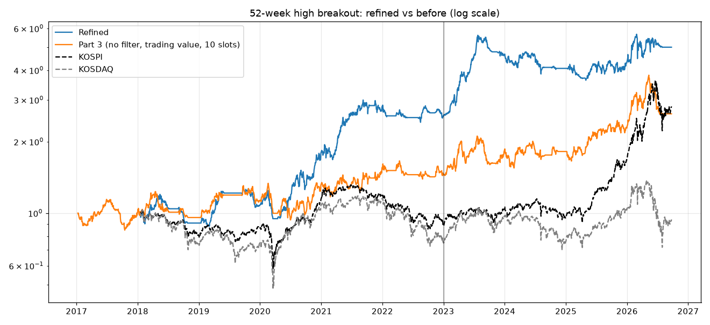
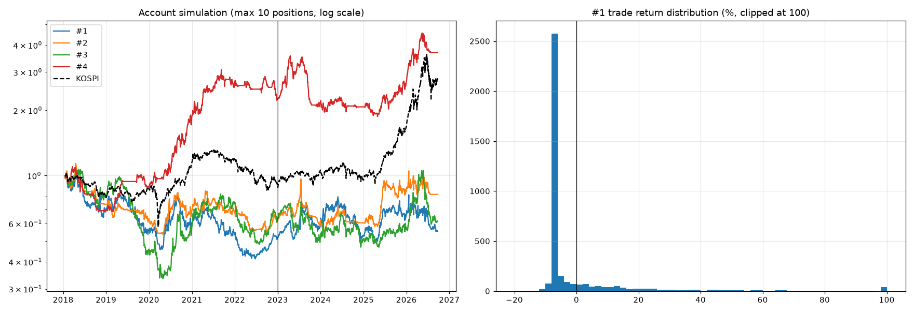

# 한국 주식 주가 예측 모델

코스피·코스닥 전 종목 10년치(2016~2026) 일봉 데이터로 만든 머신러닝 주가 예측 실험입니다.

> ⚠️ 공부용 실험입니다. 투자 권유가 아니며, 과거 성과가 미래 수익을 보장하지 않습니다.

## 실행 방법

```bash
pip install pandas numpy requests pyarrow lightgbm scikit-learn matplotlib
python collect_data.py   # 데이터 받기 (약 10분, data/ 폴더에 저장)
python model.py          # 모델 학습 + 평가 (약 1분, results/ 폴더에 저장)
python strategies.py     # 기술적 매수 전략 비교 (약 1분)
python best_strategies.py  # 매도 규칙까지 최적화 (약 2분)
python refine_breakout.py  # 신고가 전략 다듬기 (약 2분)
python ath_ma_exit.py      # 역사적 신고가 + 이평선 매도 검증 (약 1분)
```

## 무엇을 예측하나?

주가 숫자 자체(예: "내일 삼성전자 28만 원")를 맞히는 건 사실상 불가능합니다.
그래서 질문을 바꿨습니다.

> **"다음 1주일(5거래일) 동안 이 종목이 다른 종목들의 중간값보다 더 오를까?"**

- **입력(지표 20개):** 최근 수익률(1일~1년), 변동성, 이동평균과의 거리, 1년 최고가/최저가 대비 위치, RSI, 거래량 변화, 거래대금, 시장 전체 흐름
- **모델:** LightGBM (표 형태 데이터에 강한 머신러닝 모델)
- **대상:** 하루 평균 거래대금 10억 원 이상, 주가 1,000원 이상인 종목 (하루 평균 약 1,000종목)
- **기간 나누기:** 학습 2016~2022 / 검증 2023 / **시험 2024~2026.9 (모델이 처음 보는 데이터)**
- **매매 가정:** 매주 점수 상위 20종목을 다음날 시가에 똑같은 금액으로 사서 1주일 보유, 거래비용 0.25% 차감

## 결과 (시험 기간 2024.01 ~ 2026.09)

| | 모델 상위 20 | 저변동성 상위 20 (단순 규칙) | 전 종목 동일비중 | 코스피 지수 |
|---|---|---|---|---|
| 누적수익률 | **+47.9%** | +38.3% | -4.1% | **+165%** |
| 연평균수익률 | 16.0% | 13.1% | -1.6% | - |
| 샤프지수 | 0.59 | **0.88** | 0.10 | - |
| 최대낙폭 | -42.4% | **-11.6%** | -45.2% | - |

- AUC 0.558 (0.5 = 동전 던지기) / IC 평균 0.12



## 솔직한 해석

1. **예측력은 있습니다.** 점수를 10구간으로 나누면 점수가 높을수록 실제 수익률이 거의 순서대로 높았습니다.
2. **하지만 "오를 종목"보다 "떨어질 종목"을 더 잘 맞힙니다.** 가장 낮은 점수 구간은 주당 평균 -1.4%로, 모델 하위 20종목은 약 -98%였습니다. 가장 쓸모 있는 용도는 "피해야 할 종목 거르기"일 수 있습니다.
3. **코스피 지수에는 크게 졌습니다.** 이 기간 코스피 상승은 삼성전자·SK하이닉스 같은 초대형주가 이끌었고, 이 모델은 종목을 똑같은 금액으로 사기 때문에 그 효과를 거의 누리지 못했습니다.
4. **복잡한 모델이 단순한 규칙보다 꼭 낫지는 않았습니다.** "변동성이 가장 낮은 20종목 사기" 규칙이 수익은 조금 낮지만 위험 대비 성과(샤프지수)와 최대낙폭은 훨씬 좋았습니다.

## 한계

- **생존 편향:** 현재 상장된 종목만 받을 수 있어서 상장폐지된 종목이 빠져 있습니다. 결과가 실제보다 좋게 나왔을 수 있습니다.
- **재무 데이터 없음:** PER, PBR 같은 재무 지표 없이 가격과 거래량만 사용했습니다.
- **거래비용 가정:** 소형주는 실제 호가 차이(슬리피지)가 0.25%보다 클 수 있습니다.
- **시험 기간 1번:** 2024~2026 한 구간만 시험했습니다.

---

# 2부: 기술적 매수 전략 비교 (`strategies.py`)

## 규칙
- **매수:** 신호가 뜬 날 종가를 보고 다음날 시가에 매수
- **성공(승률):** 매수 후 20거래일 안에 고가가 매수가 대비 +15% 이상
- **매도:** 종가 25일선 이탈 시 50%, 60일선 이탈 시 나머지 50% (각각 다음날 시가)
- 같은 종목에서 같은 신호가 20일 안에 반복되면 중복 제외, 거래비용 0.25% 차감
- 31개 전략을 **2016~2022(발견 기간)** 승률로 순위를 매기고, **2023~2026(확인 기간)**으로 다시 검증

## 승률 상위 5개 전략

| 순위 | 전략 | 발견 승률 | 확인 승률 | 평균수익률 (이평선 매도) | 평균수익률 (+15% 익절 추가) |
|---|---|---|---|---|---|
| 1 | 이격도 과매도 (20일선 대비 -20%) 후 양봉 | 61.6% | 50.8% | -1.0% | -0.7% |
| 2 | 상한가 (+29% 이상) 다음날 매수 | 55.6% | 56.1% | -6.3% | -0.5% |
| 3 | 15~29% 급등 다음날 매수 | 50.2% | 50.5% | -2.5% | -0.3% |
| 4 | 52주 신고가 돌파 + 거래량 3배 + 5%↑ 양봉 | 48.0% | 48.9% | -1.0% | +0.5% |
| 5 | 역사적 신고가 돌파 (10년 내) | 45.5% | 50.2% | **+1.0%** | +0.7% |
| - | (기준) 아무 날이나 매수 | 29.0% | 33.3% | -0.3% | -0.2% |



## 해석
1. **상위 5개는 모두 기준(아무 날이나 매수)보다 승률이 15~30%p 높고, 확인 기간에도 유지되었습니다.**
2. **하지만 승률이 높다고 돈을 버는 건 아닙니다.** 5개 모두 "많이 움직이는 종목"을 고르는 신호라서, +15%도 자주 닿지만 크게 떨어지기도 합니다. 특히 상한가 매수는 승률 56%인데 평균 -6.3%였습니다. 올라갔다가 이평선 아래로 다시 떨어질 때까지 들고 있기 때문입니다.
3. **+15%에 익절하는 규칙을 더하면** 손실이 크게 줄지만, 여전히 수익은 0% 근처입니다.
4. **1위(이격도 과매도)는 매도 규칙과 맞지 않습니다.** 매수 시점에 이미 25일선·60일선 아래라서 평균 3일 만에 팔립니다. 승률도 2020년 코로나 폭락 후 반등에 많이 의존합니다.
5. 이평선 매도 규칙 그대로 **평균 수익이 플러스인 전략은 5위 "역사적 신고가 돌파"(+1.0%)뿐**이었습니다.

---

# 3부: 매도 규칙까지 최적화한 최고 전략 5개 (`best_strategies.py`)

## 방법
- **고정:** 다음날 시가 매수, 성공 = 20거래일 안에 고가 +15% 이상
- **매수 신호 62개:** 2부의 31개 × "시장 상승장일 때만"(종목이 속한 지수가 60일선 위) 필터 유무
- **매도 규칙 20개:** 익절(+10/15/20/30%), 손절(-5/7/10%), 추적 손절, 이평선(5/10/20/25/60일) 이탈, 기간 청산, 분할 매도 조합
- **선정 기준 (2016~2022 발견 기간만 사용):** 승률 40% 이상, 신호 300번 이상인 조합 중 거래당 평균수익률(비용 0.25% 차감)이 높은 순서로, 서로 다른 매수 신호 5개
- **검증:** 2023~2026 확인 기간 + 계좌 시뮬레이션 (최대 10종목 동시 보유, 종목당 자산 1/10, 같은 날 신호가 많으면 거래대금 큰 종목 우선)

## 결과: 5개 모두 매도 규칙은 **"+15% 익절 / 20일째 청산 / 손절 없음"**이 가장 좋았음

| 순위 | 매수 신호 | 확인 승률 | 확인 평균수익 | 계좌 연평균 (2023~) | 계좌 최대낙폭 | 판정 |
|---|---|---|---|---|---|---|
| 1 | 이격도 과매도 (20일선 -20%) 후 양봉 | 50.8% | -0.11% | -12.4% | -53.2% | ❌ 2020년 폭락 반등에만 통함 |
| 2 | 52주 신고가 + 거래량 3배 + 5%↑ [상승장만] | 49.9% | +0.50% | +2.5% | -46.7% | △ 약함 |
| 3 | 52주 신고가 돌파 [상승장만] | 46.7% | +0.60% | +16.6% | -31.6% | ○ |
| 4 | 52주 신고가 + 거래량 2배 [상승장만] | 47.3% | +0.48% | **+26.4%** | -29.3% | ○ |
| 5 | 역사적 신고가 돌파 (10년 내) [상승장만] | **52.3%** | **+1.63%** | +13.6% | -47.6% | ○ |

같은 기간 코스피 +218%, 코스닥 +26%.



## 배운 점
1. **"+15% 익절 + 20일 청산"이 최고였습니다.** 성공 기준과 매도 규칙이 딱 맞기 때문입니다.
2. **손절은 오히려 손해였습니다.** 신고가 돌파 종목은 돌파 직후 흔들리다가 다시 오르는 경우가 많아서, -5~10% 손절에 걸려 나간 뒤 오르는 일이 잦았습니다.
3. **"상승장일 때만" 필터는 모든 신호에서 효과가 있었습니다.**
4. **살아남은 건 "신고가 돌파" 계열입니다.** 과매도 반등은 확인 기간에 무너졌습니다.
5. **계좌 수익은 코스피를 이기지 못했습니다.** 2025~2026년 코스피 급등은 초대형주가 이끌었습니다.
6. 계좌 시뮬레이션은 "같은 날 신호가 많을 때 무엇을 먼저 사는지"에 따라 결과가 크게 달라집니다(거래대금 큰 종목 우선이 더 좋았음).

---

# 4부: 신고가 돌파 전략 다듬기 (`refine_breakout.py`)

## 방법
- **고정:** 52주 신고가 돌파 + 상승장, 다음날 시가 매수 / +15% 익절, 20일째 청산, 손절 없음
- **특징 분석:** 거래 8,046건을 12가지 특징(거래량, 당일 상승률, 이격도, 변동성, 역사적 신고가 여부 등)별로 5구간씩 나눠 비교
- **계좌 시뮬레이션 147개:** 매수 필터 7개 × 같은 날 매수 우선순위 7개 × 동시 보유 종목 수(5/10/20)
- 필터 기준값과 최종 선택은 **2016~2022 발견 기간으로만** 정하고, 2023~2026으로 검증

## 알게 된 것
1. **승률은 확실히 올릴 수 있습니다.** 변동성·거래량·당일 상승률·이격도가 클수록 두 기간 모두 승률이 꾸준히 높았습니다(변동성 상위 20%: 59~62%, 하위 20%: 24~29%). 크게 움직이는 종목일수록 +15%에 자주 닿기 때문입니다.
2. **하지만 승률을 높이는 필터는 수익을 올리지 못했습니다.** 승률을 53%까지 올린 필터들은 확인 기간 계좌 수익이 연 -4% 수준으로 떨어졌습니다. 승률과 수익은 다른 문제입니다.
3. **"같은 날 무엇부터 살지"는 거의 운입니다.** 발견 기간 1등 규칙이 확인 기간에는 중간 이하였고, 무작위가 더 좋은 경우도 많았습니다.
4. **동시 보유 5종목은 너무 불안정합니다.** 10~20종목이 안정적이었습니다.
5. **"역사적 신고가(10년 내)만" 필터가 가장 튼튼했습니다.** 10·20종목 보유에서는 우선순위를 무엇으로 하든 확인 기간 샤프지수가 0.64~1.09로 좋았습니다.

## 최종 전략

| 항목 | 내용 |
|---|---|
| 매수 조건 | 종가가 **역사적 신고가(10년 내)** 돌파 + 그 종목의 시장 지수가 60일선 위 |
| 매수 | 다음날 시가, 동시에 최대 **10종목**, 종목당 자산의 1/10 |
| 신호가 많을 때 | 최근 변동성 큰 순 (다만 우선순위 효과는 작음) |
| 매도 | **+15% 익절**, 못 오르면 **20일째 종가 청산**, 손절 없음 |

| | 3부 전략 (52주 신고가, 거래대금 순) | **최종 전략** |
|---|---|---|
| 승률 (발견 → 확인) | 42.8% → 46.7% | 45.2% → 49.4% |
| 거래당 평균 | +1.01% → +0.60% | +0.83% → **+1.41%** |
| 계좌 연평균 수익 | +6.5% → +17.2% | **+20.9% → +19.4%** |
| 최대낙폭 | -29.9% → -31.6% | -26.6% → -35.4% |
| 샤프지수 | 0.40 → 0.73 | **0.96 → 0.79** |



## 주의
- 수익이 2020~2021년과 2023년 상반기(2차전지 급등)에 몰려 있고, 2023년 하반기~2025년은 제자리였습니다.
- 147개 조합 중에서 고른 것이라 실제 성과는 이보다 낮을 수 있습니다(과최적화).
- 상장폐지 종목 누락(생존 편향), 소형주 체결 가격 차이는 여전히 한계입니다.

---

# 5부: 역사적 신고가 + 손절 -7% + 25일선/60일선 분할 매도 (`ath_ma_exit.py`)

## 규칙
- 매수: 역사적 신고가(10년 내) 돌파 → 다음날 시가
- 손절: -7% 도달 시 전량 / 매도: 25일선 이탈 50%, 60일선 이탈 50% (최대 1년 보유)
- 계좌: 최대 10종목, 종목당 1/10, 같은 날 신호는 거래대금 큰 순

## 결과 (표기: 발견 2016~22 → 확인 2023~26)

| 전략 | 승률 | 거래당 평균 | 수익 난 비율 | 계좌 연평균 | 최대낙폭 |
|---|---|---|---|---|---|
| ① 요청 전략 | 45.5% → 50.2% | -1.0% → +3.4% | 18% → 24% | **-12.7% → +1.8%** | -61% → -38% |
| ② 요청 전략 + 상승장만 | 45.5% → 52.3% | -1.2% → +4.0% | 18% → 25% | -9.3% → +7.6% | -53% → -43% |
| ③ 손절 없이 이평선 매도만 | 45.5% → 50.2% | -0.8% → +4.1% | 32% → 38% | -9.0% → -0.9% | -69% → -44% |
| ④ 4부 최종 (상승장, +15% 익절/20일) | 45.5% → 52.3% | +0.4% → +1.6% | 54% → 59% | **+17.7% → +14.0%** | -38% → -48% |



## 왜 안 좋았나
1. **손절이 너무 먼저 걸립니다.** 신고가 돌파일에 주가는 25일선보다 평균 25%, 60일선보다 35% 위에 있습니다. 그래서 25일선에 닿기 한참 전에 -7% 손절이 먼저 걸립니다. 거래의 **69%가 손절로 끝났고, 손절까지 걸린 기간은 중간값 3일**이었습니다.
2. **손절된 거래의 37%는 결국 20일 안에 +15%까지 올랐습니다.** 돌파 직후 흔들림에 털린 것입니다.
3. **가끔 나오는 큰 수익(+30% 이상 약 6%)이 손실을 메우는 구조**라서 거래당 평균은 플러스여도, 계좌에서는 그 큰 수익 종목을 못 담는 경우가 많아 성과가 나빴습니다.
4. 같은 매수 신호(②와 ④)에서 매도 방식만 바꿔도 계좌 연수익이 약 -9%에서 +18%로 달라졌습니다(발견 기간). **이 신호에는 "빨리 익절" 방식이 맞습니다.**

## 파일 구성

| 파일 | 설명 |
|---|---|
| `collect_data.py` | 네이버 금융에서 전 종목 목록과 수정주가 받기 |
| `model.py` | 지표 계산 → 모델 학습 → 백테스트 → 결과 저장 |
| `results/summary.csv` | 성과 요약표 |
| `results/decile_returns.csv` | 점수 구간별 평균 수익률 |
| `results/weekly_returns.csv` | 주별 수익률 기록 |
| `results/latest_picks.csv` | 가장 최근 날짜 기준 모델 상위 종목 (참고용) |
| `strategies.py` | 31개 기술적 매수 전략의 승률·수익률 비교 |
| `results/strategies_all.csv` | 전체 전략 결과 |
| `results/strategies_top5.csv`, `strategies_exit_compare.csv` | 상위 5개 전략, 매도 규칙 비교 |
| `best_strategies.py` | 매수 신호 × 매도 규칙 1,240개 조합 비교 + 계좌 시뮬레이션 |
| `results/best_all_combinations.csv` | 1,240개 조합 전체 결과 |
| `results/best_top5.csv`, `best_portfolio.csv` | 최고 전략 5개, 계좌 시뮬레이션 결과 |
| `refine_breakout.py` | 신고가 돌파 특징 분석 + 필터·우선순위·보유수 147개 계좌 시뮬레이션 |
| `results/breakout_features.csv`, `breakout_grid.csv` | 특징별 구간 분석, 147개 조합 결과 |
| `ath_ma_exit.py` | 역사적 신고가 + 손절 -7% + 25/60일선 분할 매도 검증 |
| `results/ath_ma_exit.csv` | 5부 결과 |
| `data/` | 받은 주가 데이터 (용량 문제로 저장소에는 올리지 않음) |
