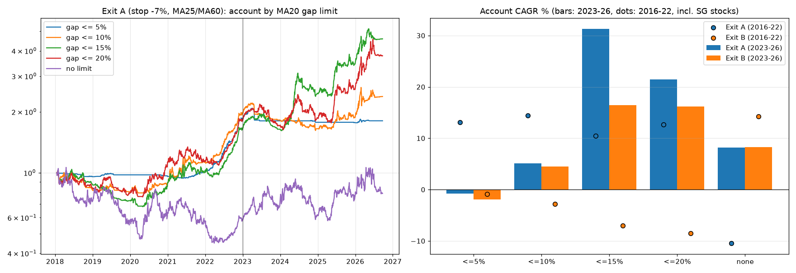
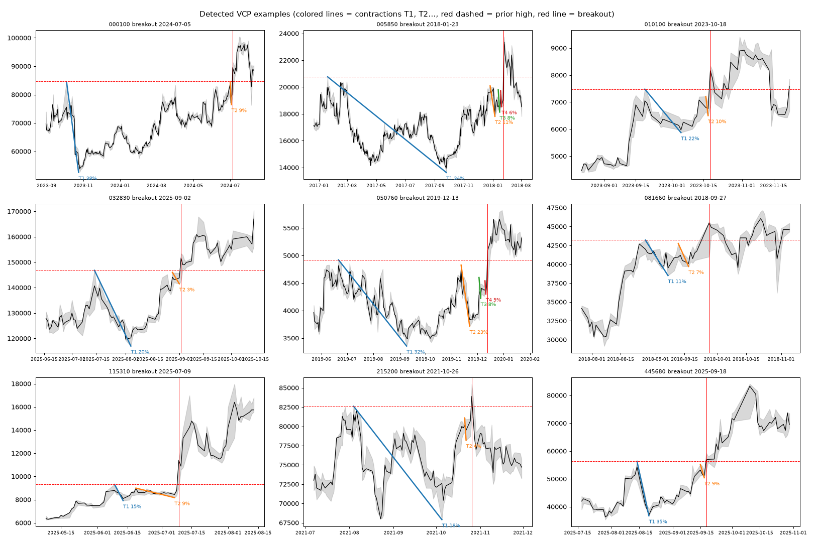
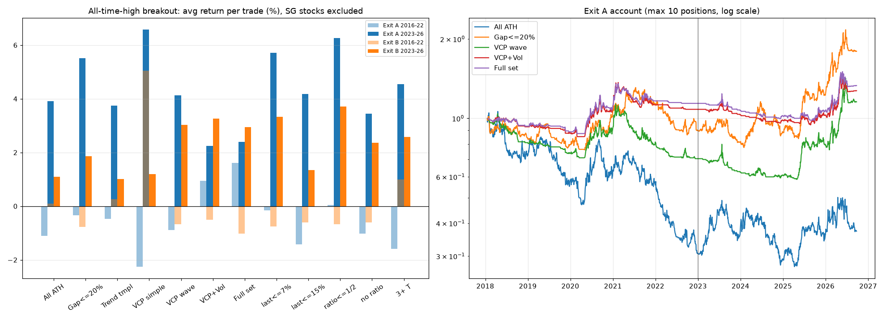
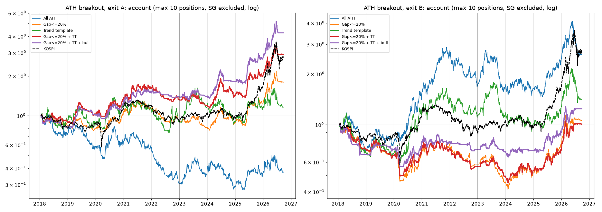
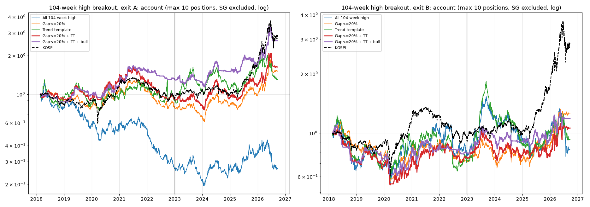
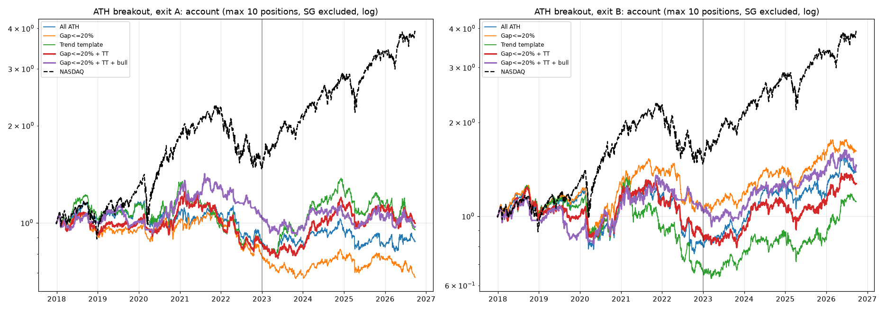
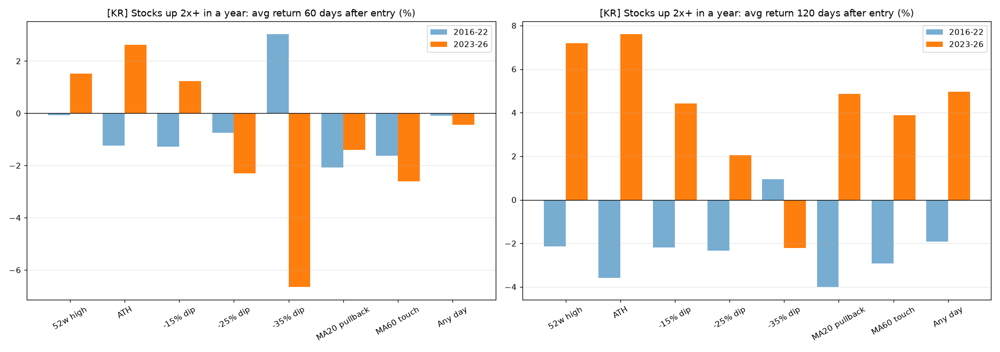
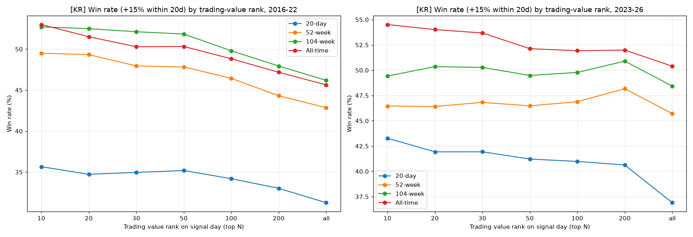

# 한국 주식 주가 예측 모델

코스피·코스닥 전 종목 10년치(2016~2026) 일봉 데이터로 만든 머신러닝 주가 예측 실험입니다.

> ⚠️ 공부용 실험입니다. 투자 권유가 아니며, 과거 성과가 미래 수익을 보장하지 않습니다.

## 실행 방법

```bash
pip install pandas numpy requests pyarrow lightgbm scikit-learn matplotlib
python collect_data.py   # 데이터 받기 (약 10분, data/ 폴더에 저장)
python model.py          # 모델 학습 + 평가 (약 1분, results/ 폴더에 저장)
python strategies.py     # 기술적 매수 전략 비교 (약 1분)
python best_strategies.py  # 매도 규칙까지 최적화 (약 2분)
python refine_breakout.py  # 신고가 전략 다듬기 (약 2분)
python ath_ma_exit.py      # 역사적 신고가 + 이평선 매도 검증 (약 1분)
python ath_low_gap.py      # 20일선 이격 제한 검증 (약 3분)
python vcp_test.py         # VCP 검증 (약 2분)
python gap_tt_test.py      # 이격 + 트렌드 템플릿 검증 (약 3분)
python gap_tt_test.py 104w # 같은 시험을 104주 신고가 기준으로
python collect_data_us.py  # 미국 데이터 받기 (약 15분)
MARKET=us python gap_tt_test.py   # 미국에 같은 규칙 적용
python doubled_test.py     # 2배 오른 종목: 조정 매수 vs 돌파 매수 (MARKET=us 로 미국)
python tv_rank_test.py     # 거래대금 순위 + 신고가 (MARKET=us 로 미국)
```

## 무엇을 예측하나?

주가 숫자 자체(예: "내일 삼성전자 28만 원")를 맞히는 건 사실상 불가능합니다.
그래서 질문을 바꿨습니다.

> **"다음 1주일(5거래일) 동안 이 종목이 다른 종목들의 중간값보다 더 오를까?"**

- **입력(지표 20개):** 최근 수익률(1일~1년), 변동성, 이동평균과의 거리, 1년 최고가/최저가 대비 위치, RSI, 거래량 변화, 거래대금, 시장 전체 흐름
- **모델:** LightGBM (표 형태 데이터에 강한 머신러닝 모델)
- **대상:** 하루 평균 거래대금 10억 원 이상, 주가 1,000원 이상인 종목 (하루 평균 약 1,000종목)
- **기간 나누기:** 학습 2016~2022 / 검증 2023 / **시험 2024~2026.9 (모델이 처음 보는 데이터)**
- **매매 가정:** 매주 점수 상위 20종목을 다음날 시가에 똑같은 금액으로 사서 1주일 보유, 거래비용 0.25% 차감

## 결과 (시험 기간 2024.01 ~ 2026.09)

| | 모델 상위 20 | 저변동성 상위 20 (단순 규칙) | 전 종목 동일비중 | 코스피 지수 |
|---|---|---|---|---|
| 누적수익률 | **+47.9%** | +38.3% | -4.1% | **+165%** |
| 연평균수익률 | 16.0% | 13.1% | -1.6% | - |
| 샤프지수 | 0.59 | **0.88** | 0.10 | - |
| 최대낙폭 | -42.4% | **-11.6%** | -45.2% | - |

- AUC 0.558 (0.5 = 동전 던지기) / IC 평균 0.12


## 솔직한 해석

1. **예측력은 있습니다.** 점수를 10구간으로 나누면 점수가 높을수록 실제 수익률이 거의 순서대로 높았습니다.
2. **하지만 "오를 종목"보다 "떨어질 종목"을 더 잘 맞힙니다.** 가장 낮은 점수 구간은 주당 평균 -1.4%로, 모델 하위 20종목은 약 -98%였습니다. 가장 쓸모 있는 용도는 "피해야 할 종목 거르기"일 수 있습니다.
3. **코스피 지수에는 크게 졌습니다.** 이 기간 코스피 상승은 삼성전자·SK하이닉스 같은 초대형주가 이끌었고, 이 모델은 종목을 똑같은 금액으로 사기 때문에 그 효과를 거의 누리지 못했습니다.
4. **복잡한 모델이 단순한 규칙보다 꼭 낫지는 않았습니다.** "변동성이 가장 낮은 20종목 사기" 규칙이 수익은 조금 낮지만 위험 대비 성과(샤프지수)와 최대낙폭은 훨씬 좋았습니다.

## 한계

- **생존 편향:** 현재 상장된 종목만 받을 수 있어서 상장폐지된 종목이 빠져 있습니다. 결과가 실제보다 좋게 나왔을 수 있습니다.
- **재무 데이터 없음:** PER, PBR 같은 재무 지표 없이 가격과 거래량만 사용했습니다.
- **거래비용 가정:** 소형주는 실제 호가 차이(슬리피지)가 0.25%보다 클 수 있습니다.
- **시험 기간 1번:** 2024~2026 한 구간만 시험했습니다.

---

# 2부: 기술적 매수 전략 비교 (`strategies.py`)

## 규칙
- **매수:** 신호가 뜬 날 종가를 보고 다음날 시가에 매수
- **성공(승률):** 매수 후 20거래일 안에 고가가 매수가 대비 +15% 이상
- **매도:** 종가 25일선 이탈 시 50%, 60일선 이탈 시 나머지 50% (각각 다음날 시가)
- 같은 종목에서 같은 신호가 20일 안에 반복되면 중복 제외, 거래비용 0.25% 차감
- 31개 전략을 **2016~2022(발견 기간)** 승률로 순위를 매기고, **2023~2026(확인 기간)**으로 다시 검증

## 승률 상위 5개 전략

| 순위 | 전략 | 발견 승률 | 확인 승률 | 평균수익률 (이평선 매도) | 평균수익률 (+15% 익절 추가) |
|---|---|---|---|---|---|
| 1 | 이격도 과매도 (20일선 대비 -20%) 후 양봉 | 61.6% | 50.8% | -1.0% | -0.7% |
| 2 | 상한가 (+29% 이상) 다음날 매수 | 55.6% | 56.1% | -6.3% | -0.5% |
| 3 | 15~29% 급등 다음날 매수 | 50.2% | 50.5% | -2.5% | -0.3% |
| 4 | 52주 신고가 돌파 + 거래량 3배 + 5%↑ 양봉 | 48.0% | 48.9% | -1.0% | +0.5% |
| 5 | 역사적 신고가 돌파 (10년 내) | 45.5% | 50.2% | **+1.0%** | +0.7% |
| - | (기준) 아무 날이나 매수 | 29.0% | 33.3% | -0.3% | -0.2% |


## 해석
1. **상위 5개는 모두 기준(아무 날이나 매수)보다 승률이 15~30%p 높고, 확인 기간에도 유지되었습니다.**
2. **하지만 승률이 높다고 돈을 버는 건 아닙니다.** 5개 모두 "많이 움직이는 종목"을 고르는 신호라서, +15%도 자주 닿지만 크게 떨어지기도 합니다. 특히 상한가 매수는 승률 56%인데 평균 -6.3%였습니다. 올라갔다가 이평선 아래로 다시 떨어질 때까지 들고 있기 때문입니다.
3. **+15%에 익절하는 규칙을 더하면** 손실이 크게 줄지만, 여전히 수익은 0% 근처입니다.
4. **1위(이격도 과매도)는 매도 규칙과 맞지 않습니다.** 매수 시점에 이미 25일선·60일선 아래라서 평균 3일 만에 팔립니다. 승률도 2020년 코로나 폭락 후 반등에 많이 의존합니다.
5. 이평선 매도 규칙 그대로 **평균 수익이 플러스인 전략은 5위 "역사적 신고가 돌파"(+1.0%)뿐**이었습니다.

---

# 3부: 매도 규칙까지 최적화한 최고 전략 5개 (`best_strategies.py`)

## 방법
- **고정:** 다음날 시가 매수, 성공 = 20거래일 안에 고가 +15% 이상
- **매수 신호 62개:** 2부의 31개 × "시장 상승장일 때만"(종목이 속한 지수가 60일선 위) 필터 유무
- **매도 규칙 20개:** 익절(+10/15/20/30%), 손절(-5/7/10%), 추적 손절, 이평선(5/10/20/25/60일) 이탈, 기간 청산, 분할 매도 조합
- **선정 기준 (2016~2022 발견 기간만 사용):** 승률 40% 이상, 신호 300번 이상인 조합 중 거래당 평균수익률(비용 0.25% 차감)이 높은 순서로, 서로 다른 매수 신호 5개
- **검증:** 2023~2026 확인 기간 + 계좌 시뮬레이션 (최대 10종목 동시 보유, 종목당 자산 1/10, 같은 날 신호가 많으면 거래대금 큰 종목 우선)

## 결과: 5개 모두 매도 규칙은 **"+15% 익절 / 20일째 청산 / 손절 없음"**이 가장 좋았음

| 순위 | 매수 신호 | 확인 승률 | 확인 평균수익 | 계좌 연평균 (2023~) | 계좌 최대낙폭 | 판정 |
|---|---|---|---|---|---|---|
| 1 | 이격도 과매도 (20일선 -20%) 후 양봉 | 50.8% | -0.11% | -12.4% | -53.2% | ❌ 2020년 폭락 반등에만 통함 |
| 2 | 52주 신고가 + 거래량 3배 + 5%↑ [상승장만] | 49.9% | +0.50% | +2.5% | -46.7% | △ 약함 |
| 3 | 52주 신고가 돌파 [상승장만] | 46.7% | +0.59% | +14.5% | -31.6% | ○ |
| 4 | 52주 신고가 + 거래량 2배 [상승장만] | 47.3% | +0.48% | **+26.4%** | -29.3% | ○ |
| 5 | 역사적 신고가 돌파 (10년 내) [상승장만] | **52.3%** | **+1.63%** | +13.6% | -47.6% | ○ |

같은 기간 코스피 +218%, 코스닥 +26%.


## 배운 점
1. **"+15% 익절 + 20일 청산"이 최고였습니다.** 성공 기준과 매도 규칙이 딱 맞기 때문입니다.
2. **손절은 오히려 손해였습니다.** 신고가 돌파 종목은 돌파 직후 흔들리다가 다시 오르는 경우가 많아서, -5~10% 손절에 걸려 나간 뒤 오르는 일이 잦았습니다.
3. **"상승장일 때만" 필터는 모든 신호에서 효과가 있었습니다.**
4. **살아남은 건 "신고가 돌파" 계열입니다.** 과매도 반등은 확인 기간에 무너졌습니다.
5. **계좌 수익은 코스피를 이기지 못했습니다.** 2025~2026년 코스피 급등은 초대형주가 이끌었습니다.
6. 계좌 시뮬레이션은 "같은 날 신호가 많을 때 무엇을 먼저 사는지"에 따라 결과가 크게 달라집니다(거래대금 큰 종목 우선이 더 좋았음).

---

# 4부: 신고가 돌파 전략 다듬기 (`refine_breakout.py`)

## 방법
- **고정:** 52주 신고가 돌파 + 상승장, 다음날 시가 매수 / +15% 익절, 20일째 청산, 손절 없음
- **특징 분석:** 거래 8,046건을 12가지 특징(거래량, 당일 상승률, 이격도, 변동성, 역사적 신고가 여부 등)별로 5구간씩 나눠 비교
- **계좌 시뮬레이션 147개:** 매수 필터 7개 × 같은 날 매수 우선순위 7개 × 동시 보유 종목 수(5/10/20)
- 필터 기준값과 최종 선택은 **2016~2022 발견 기간으로만** 정하고, 2023~2026으로 검증

## 알게 된 것
1. **승률은 확실히 올릴 수 있습니다.** 변동성·거래량·당일 상승률·이격도가 클수록 두 기간 모두 승률이 꾸준히 높았습니다(변동성 상위 20%: 59~62%, 하위 20%: 24~29%). 크게 움직이는 종목일수록 +15%에 자주 닿기 때문입니다.
2. **하지만 승률을 높이는 필터는 수익을 올리지 못했습니다.** 승률을 53%까지 올린 필터들은 확인 기간 계좌 수익이 연 -4% 수준으로 떨어졌습니다. 승률과 수익은 다른 문제입니다.
3. **"같은 날 무엇부터 살지"는 거의 운입니다.** 발견 기간 1등 규칙이 확인 기간에는 중간 이하였고, 무작위가 더 좋은 경우도 많았습니다.
4. **동시 보유 5종목은 너무 불안정합니다.** 10~20종목이 안정적이었습니다.
5. **"역사적 신고가(10년 내)만" 필터가 가장 튼튼했습니다.** 10·20종목 보유에서는 우선순위를 무엇으로 하든 확인 기간 샤프지수가 0.64~1.09로 좋았습니다.

## 최종 전략

| 항목 | 내용 |
|---|---|
| 매수 조건 | 종가가 **역사적 신고가(10년 내)** 돌파 + 그 종목의 시장 지수가 60일선 위 |
| 매수 | 다음날 시가, 동시에 최대 **10종목**, 종목당 자산의 1/10 |
| 신호가 많을 때 | 최근 변동성 큰 순 (다만 우선순위 효과는 작음) |
| 매도 | **+15% 익절**, 못 오르면 **20일째 종가 청산**, 손절 없음 |

| | 3부 전략 (52주 신고가, 거래대금 순) | **최종 전략** |
|---|---|---|
| 승률 (발견 → 확인) | 42.8% → 46.7% | 45.2% → 49.4% |
| 거래당 평균 | +1.01% → +0.60% | +0.83% → **+1.41%** |
| 계좌 연평균 수익 | +6.6% → +15.1% | **+20.9% → +19.4%** |
| 최대낙폭 | -29.9% → -31.6% | -26.6% → -35.4% |
| 샤프지수 | 0.40 → 0.66 | **0.96 → 0.79** |


## 주의
- 수익이 2020~2021년과 2023년 상반기(2차전지 급등)에 몰려 있고, 2023년 하반기~2025년은 제자리였습니다.
- 147개 조합 중에서 고른 것이라 실제 성과는 이보다 낮을 수 있습니다(과최적화).
- 상장폐지 종목 누락(생존 편향), 소형주 체결 가격 차이는 여전히 한계입니다.

---

# 5부: 역사적 신고가 + 손절 -7% + 25일선/60일선 분할 매도 (`ath_ma_exit.py`)

## 규칙
- 매수: 역사적 신고가(10년 내) 돌파 → 다음날 시가
- 손절: -7% 도달 시 전량 / 매도: 25일선 이탈 50%, 60일선 이탈 50% (최대 1년 보유)
- 계좌: 최대 10종목, 종목당 1/10, 같은 날 신호는 거래대금 큰 순

## 결과 (표기: 발견 2016~22 → 확인 2023~26)

| 전략 | 승률 | 거래당 평균 | 수익 난 비율 | 계좌 연평균 | 최대낙폭 |
|---|---|---|---|---|---|
| ① 요청 전략 | 45.5% → 50.2% | -0.4% → +3.9% | 19% → 24% | **-10.4% → +8.2%** | -58% → -38% |
| ② 요청 전략 + 상승장만 | 45.5% → 52.3% | -0.7% → +4.6% | 19% → 25% | -7.5% → +17.3% | -53% → -37% |
| ③ 손절 없이 이평선 매도만 | 45.5% → 50.2% | -0.8% → +4.1% | 32% → 38% | -9.0% → -0.9% | -69% → -44% |
| ④ 4부 최종 (상승장, +15% 익절/20일) | 45.5% → 52.3% | +0.4% → +1.6% | 54% → 59% | **+17.7% → +14.0%** | -38% → -48% |


## 왜 안 좋았나
1. **손절이 너무 먼저 걸립니다.** 신고가 돌파일에 주가는 25일선보다 평균 25%, 60일선보다 35% 위에 있습니다. 그래서 25일선에 닿기 한참 전에 -7% 손절이 먼저 걸립니다. 거래의 **69%가 손절로 끝났고, 손절까지 걸린 기간은 중간값 3일**이었습니다.
2. **손절된 거래의 36%는 결국 20일 안에 +15%까지 올랐습니다.** 돌파 직후 흔들림에 털린 것입니다.
3. **가끔 나오는 큰 수익(+30% 이상 약 6%)이 손실을 메우는 구조**라서 거래당 평균은 플러스여도, 계좌에서는 그 큰 수익 종목을 못 담는 경우가 많아 성과가 나빴습니다.
4. 같은 매수 신호(②와 ④)에서 매도 방식만 바꿔도 발견 기간 계좌 연수익이 -7.5%에서 +17.7%로 달라졌습니다. 확인 기간에는 ②가 +17.3%로 ④(+14.0%)보다 좋았지만, 두 기간 모두 꾸준한 건 ④였습니다.

---

# 6부: 역사적 신고가 + 20일선 가까울 때만 매수 (`ath_low_gap.py`)

## 아이디어
5부에서는 돌파일 주가가 25일선보다 평균 25% 위에 있어서 -7% 손절이 먼저 걸렸습니다.
그래서 **20일선 이격도(종가 / 20일선 - 1)가 작을 때 돌파한 경우만** 사 봤습니다.
역사적 신고가 돌파 3,751건 중 이격 10% 이하는 10%, 15% 이하는 25%, 20% 이하는 41%입니다(중간값 23.7%).

## 결과: 매도 A (손절 -7% / 25일선 50% / 60일선 50%), 계좌 연평균 (발견 2016~22 → 확인 2023~26)

| 20일선 이격 | 거래수 | 승률 | 손절 비율 | 계좌 연평균 | 샤프 |
|---|---|---|---|---|---|
| 5% 이하 | 42 → 9 | 7% → 11% | 19% → 22% | 거래가 너무 적어 판단 불가 | |
| 10% 이하 | 230 → 145 | 25% → 33% | 38% → 35% | +14.4% → +5.1% | 1.13 → 0.40 |
| 15% 이하 | 586 → 368 | 27% → 39% | 52% → 43% | +10.4% → +31.3% | 0.74 → 1.39 |
| **20% 이하** | 933 → 601 | 31% → 41% | 56% → 53% | **+12.7% → +21.5%** | 0.80 → 0.92 |
| 제한 없음 (5부) | 2,347 → 1,404 | 46% → 50% | 70% → 65% | -10.4% → +8.2% | -0.30 → 0.41 |
| 20% 이하 + 상승장만 | 684 → 506 | 32% → 44% | 57% → 51% | +8.7% → +33.5% | 0.61 → 1.32 |



## 해석
1. **이격을 줄이니 이평선 매도가 제대로 작동했습니다.** 제한 없음(연 -10.4%)과 비교하면 10~20% 이하 모두 두 기간에서 확실히 좋아졌습니다.
2. **대신 승률(20일 안에 +15%)은 낮아집니다.** 덜 급하게 오른 종목이라 짧은 기간에 +15%는 잘 안 가지만, 오래 들고 가며 크게 먹는 구조입니다.
3. **이 방식은 "가끔 나오는 큰 수익"에 기댑니다.** 상위 5% 거래를 빼면 거래당 평균은 -2%입니다.
4. **⚠️ 2016~2022년 수익은 주가조작 종목 덕이 컸습니다.** 코스피가 -25%였던 2022년에 낸 큰 수익의 주역이 삼천리·대성홀딩스·선광·다우데이타 등 2023년 4월 SG증권발 주가조작 사태 종목이었습니다. 이 8종목을 빼면:

| | 발견 2016~22 | 확인 2023~26 |
|---|---|---|
| A) 이격 20% 이하 | -2.1% (전체 +12.7%) | +20.5% |
| A) 이격 20% 이하 + 상승장 | +1.8% | +35.2% |
| A) 이격 15% 이하 | -5.6% | +31.2% |
| B) 4부 최종 (상승장, +15% 익절/20일) | **+16.9%** | **+17.8%** |

→ **이격 제한 + 이평선 매도는 2023~2026년엔 매우 좋았지만 2016~2022년엔 본전 수준**입니다. 두 기간 모두 꾸준했던 건 여전히 4부 최종 전략입니다.
5. 매도 B(+15% 익절/20일)에는 이격 제한이 오히려 해롭습니다. **매수 조건과 매도 방식은 짝을 맞춰야 합니다.** 급하게 오른 종목은 빨리 익절, 20일선 근처에서 돌파한 종목은 이평선으로 길게 들고 가기.

---

> **🔧 버그 수정 (7부 작업 중 발견):** `strategies.py`의 데이터 불러오기에서 거래정지일의 고가·저가가 0으로 남아 있었습니다.
> 그래서 보유 중 거래정지일이 끼면 "저가 0원"을 -7% 손절로 처리하는 문제가 있었습니다. 고친 뒤 2~6부를 모두 다시 실행해 위 숫자를 고쳤습니다.
> 손절이 없는 전략(2~4부, 5부 ③④)은 거의 그대로이고, **손절 -7%를 쓰는 5·6부 전략은 확인 기간 성과가 좋아졌습니다**(예: 5부 ② +7.6% → +17.3%). 결론은 바뀌지 않았습니다.

# 7부: 마크 미너비니 VCP 검증 (`vcp_test.py`)

## 질문
VCP(변동성 수축 패턴)로 20일선 이격을 줄인 뒤 신고가를 돌파할 때 사면 성과가 좋아질까?

## VCP 정의 (결과를 보기 전에 미너비니 책 기준으로 미리 정함)
- **베이스:** 직전 고점(돌파하는 그 고점) ~ 돌파 전날, 3~65주, 최대 조정 폭 50% 이하
- **수축 판별 (두 가지 방법)**
  - **파동 방식(주):** T1 = 직전 고점 → 베이스 최저점, T2 = 그 이후 최고점 → 그 뒤 최저점 … 반복. 3% 이상 수축이 2번 이상, 각 수축이 직전의 3/4 이하, 마지막 수축 10% 이하
  - **단순 방식:** 베이스를 기간으로 3등분 → 구간 변동폭 감소, 저점 상승, 마지막 구간 10% 이하
- **거래량:** 마지막 수축 거래량 < 첫 수축 거래량(마름), 돌파일 거래량 ≥ 50일 평균 1.5배
- **트렌드 템플릿:** 종가 > 50일선 > 150일선 > 200일선, 200일선 상승, 52주 저가 +30% 이상, RS 70 이상
- SG 주가조작 8종목 제외, 매도 A(손절 -7% / 25일선 / 60일선)와 B(+15% 익절 / 20일) 모두 확인
- **무작위 비교:** 같은 신호 묶음에서 무작위로 같은 수를 뽑아도 VCP만큼 좋게 나올 확률(5,000회)



## 결과: 역사적 신고가 돌파, 매도 A (발견 2016~22 → 확인 2023~26)

| 조건 | 거래수 | 20일선 이격 중간값 | 거래당 평균 | 계좌 연평균 | 최대낙폭 | 투자 비중 |
|---|---|---|---|---|---|---|
| 신고가 돌파 전체 | 2,318 → 1,399 | 24% | -1.1% → +3.9% | -21.2% → +5.5% | -71% → -44% | 90% |
| **20일선 이격 20% 이하 (6부)** | 907 → 596 | 14% | -0.3% → +5.5% | **-2.1% → +20.5%** | -34% → -28% | 77% |
| 트렌드 템플릿만 | 1,752 → 1,212 | 23% | -0.5% → +3.8% | -2.1% → +7.3% | -47% → -47% | 86% |
| VCP 단순 (3등분) | 14 → 14 | 11% | -2.3% → +6.6% | -0.7% → +2.4% | -4% → -5% | 5% |
| VCP 파동 | 229 → 160 | 17% | -0.9% → +4.1% | -6.9% → +14.3% | -38% → -26% | 35% |
| VCP 파동 + 거래량 | 119 → 78 | 17% | +0.9% → +2.2% | +1.6% → +4.5% | -21% → -22% | 19% |
| VCP 풀세트 (+트렌드 템플릿) | 99 → 70 | 17% | **+1.6% → +2.4%** | +2.7% → +4.3% | **-17% → -21%** | 16% |



## 무작위 비교 (매도 A, 거래당 평균 수익)

| 조건 | 나머지 신호보다 | 우연일 확률 | 이격 20% 이하 신호 안에서 | 우연일 확률 |
|---|---|---|---|---|
| VCP 파동 | +0.4%p | 31% | **-1.0%p** | 54% |
| VCP 파동 + 거래량 | +0.7%p | 28% | -1.5%p | 60% |
| VCP 풀세트 | +1.2%p | 21% | -1.0%p | 50% |
| 트렌드 템플릿만 | **+2.3%p** | **1.6%** | +2.9%p | 9% |

## 해석
1. **VCP는 실제로 이격을 줄입니다.** 20일선 이격 중간값이 24% → 17%로 낮아졌고, 그래서 신고가 돌파 전체보다는 성과가 좋아졌습니다.
2. **하지만 "이격 20% 이하" 단순 조건보다 나아지지 않았습니다.** 이격이 비슷한 종목끼리 비교하면 VCP 모양을 갖춘 쪽이 오히려 조금 나빴습니다(우연 범위). 즉 **개선 효과는 VCP 모양 자체가 아니라 "이격이 작다"는 데서 나온 것**입니다.
3. **풀세트(VCP + 거래량 + 트렌드 템플릿)는 두 기간 모두 플러스이고 낙폭이 가장 작았습니다.** 하지만 10년간 169번(연 17번)뿐이라 자금의 대부분이 놀아서 계좌 수익은 연 3~4%에 그쳤고, 우연일 확률도 21%라 확실한 효과라고 보기 어렵습니다.
4. **정의를 바꿔도 결론은 같았습니다.** 마지막 수축 7%/15%, 수축 비율 1/2, 수축 3번 이상, 52주 신고가로 표본 늘리기 모두 "이격 20% 이하"를 확실히 이기지 못했습니다.
5. **VCP 구성요소 중 트렌드 템플릿만 의미 있는 효과가 있었습니다**(우연일 확률 1.6%). 다만 20개를 검정하면 우연히 1개쯤은 5% 미만이 나오므로 따로 다시 확인이 필요합니다.
6. 매도 B(+15% 익절)에서도 VCP는 효과가 뚜렷하지 않았습니다.

---

# 8부: 역사적 신고가 + 이격 20% 이하 + 트렌드 템플릿 (`gap_tt_test.py`)

7부에서 효과가 있었던 "이격 줄이기"와 "트렌드 템플릿"을 합쳤습니다. SG 8종목 제외, 계좌는 최대 10종목.

## 결과: 역사적 신고가, 매도 A (손절 -7% / 25일선 50% / 60일선 50%)

| 조건 | 거래수 | 거래당 평균 | 계좌 연평균 | 샤프 | 최대낙폭 |
|---|---|---|---|---|---|
| 이격 20% 이하 (6부) | 907 → 596 | -0.3% → +5.5% | -2.1% → +20.5% | -0.03 → 0.88 | -34% → -28% |
| 트렌드 템플릿만 | 1,752 → 1,212 | -0.5% → +3.8% | -2.1% → +7.3% | 0.07 → 0.39 | -47% → -47% |
| **이격 20% 이하 + 트렌드 템플릿** | 724 → 548 | -0.0% → +5.7% | **+5.8% → +23.7%** | 0.41 → 0.97 | -26% → -29% |
| **+ 상승장만** | 537 → 460 | +0.7% → +7.4% | **+6.9% → +35.1%** | **0.51 → 1.35** | **-19% → -22%** |
| (참고) 4부 최종: 상승장, +15% 익절/20일 | 1,706 → 1,184 | +0.4% → +1.6% | +16.9% → +17.8% | 0.78 → 0.74 | -38% → -42% |



연도별(이격 20% 이하 + 트렌드 템플릿 + 상승장, 매도 A): 2018 -17.7%, 2019 +23.6%, 2020 +26.3%, 2021 +18.9%, 2022 -8.9%, 2023 +0.7%, 2024 +30.1%, 2025 +50.4%, 2026 +55.1%(9월까지)

## 무엇이 효과를 냈나 (이격 20% 이하 신호 안에서 무작위 비교, 매도 A)

| 트렌드 템플릿 구성요소 | 전체 차이 | 우연일 확률 | 발견 기간 | 확인 기간 |
|---|---|---|---|---|
| 트렌드 템플릿 전체 | +2.9%p | 8.8% | +1.5%p | +2.4%p |
| **정배열 (종가 > 50일 > 150일 > 200일)** | **+3.8%p** | **3.1%** | +3.3%p (0.6%) | +2.1%p (57%) |
| 200일선 1개월 상승 | +2.2%p | 48% | | |
| 52주 저가 +30% 이상 | -4.3%p | 87% | | |
| RS 70 이상 | +1.1%p | 50% | | |

## 해석
1. **이 조합은 SG 종목을 빼고도 두 기간 모두 플러스인 첫 이평선 매도 전략입니다.** 상승장 필터까지 넣으면 샤프지수와 낙폭이 지금까지 중 가장 좋았습니다.
2. **효과는 트렌드 템플릿 중 "정배열"에서 나왔습니다.** 나머지 조건(200일선 상승, 52주 저가 +30%, RS 70)은 거의 효과가 없었습니다.
3. **하지만 확실하다고 보기엔 이릅니다.**
   - 이격 기준을 15%나 25%로 바꾸면 발견 기간이 다시 마이너스(-2.8%, -3.5%)가 됩니다. 20%에서만 플러스라 기준에 민감합니다.
   - 정배열 효과는 발견 기간에는 뚜렷했지만(우연일 확률 0.6%) 확인 기간만 따로 보면 우연 범위(57%)였습니다.
   - 52주 신고가로 재확인하면 개선 폭이 작았습니다(연 -6.3% → +1.7%, 확인 +2.2% → +4.0%).
   - 이 조합은 2016~2026 전체 데이터를 이미 본 뒤에 만든 것이라, 더 이상 "처음 보는 데이터"로 검증한 결과가 아닙니다.
4. **매도 B(+15% 익절)에는 트렌드 템플릿이 도움이 안 됐습니다.** 이평선 매도처럼 길게 들고 가는 방식에서만 효과가 있었습니다.

---

# 9부: 104주(2년) 신고가 기준으로 8부 반복 (`gap_tt_test.py 104w`)

역사적 신고가 대신 "종가가 지난 520거래일(104주) 최고가를 넘은 날"로 바꿔 8부와 똑같이 시험했습니다.
역사적 신고가는 모두 104주 신고가이기도 하므로, **옛날에 더 높은 고점이 있던 종목의 2년 신고가**가 추가된 셈입니다.

## 결과: 매도 A (손절 -7% / 25일선 50% / 60일선 50%), 계좌 연평균 (발견 2016~22 → 확인 2023~26)

| 조건 | 역사적 신고가 (8부) | **104주 신고가** |
|---|---|---|
| 신고가 돌파 전체 | -21.2% → +5.5% | -23.9% → -0.6% |
| 이격 20% 이하 | -2.1% → +20.5% | -4.5% → +19.3% |
| 이격 20% 이하 + 트렌드 템플릿 | +5.8% → +23.7% | -1.7% → +16.9% |
| **+ 상승장만** | **+6.9% → +35.1%** (샤프 0.51 → 1.35, 낙폭 -19% → -22%) | +5.8% → +20.6% (샤프 0.42 → 0.86, 낙폭 -22% → -24%) |



## 왜 104주 기준이 더 나빴나
104주 신고가 신호를 나눠 보면(이격 20% 이하 + 트렌드 템플릿 + 상승장, 거래당 평균):
- **역사적 신고가인 경우:** 발견 +1.3% → 확인 +8.4%
- **역사적 신고가가 아닌 경우:** 발견 -0.9% → 확인 +1.0% (옛 최고가가 보통 30% 더 위에 있음)

→ 위에 옛 고점(매물대)이 남아 있는 2년 신고가는 잘 못 올라갔습니다. **"완전히 새로운 가격대"로 올라서는 역사적 신고가가 더 좋은 신호**였습니다.

## 그 밖에
- 트렌드 템플릿 중 **정배열 효과는 104주에서도 다시 나왔습니다**(+2.5%p, 우연일 확률 4.0%). 다만 신호의 절반이 8부와 겹쳐서 독립적인 확인은 아닙니다.
- 이격 기준 민감도는 여전했습니다(15%: -8.1% → +31.0%, 25%: -6.9% → +4.1%).
- 매도 B(+15% 익절 / 20일)는 104주 기준에서 전반적으로 약했습니다.

---

# 10부: 미국 시장에 규칙 그대로 적용 (`collect_data_us.py`, `MARKET=us`)

## 방법
- **데이터:** 나스닥·NYSE·NYSE American 보통주 4,843종목, 2016-01 ~ 2026-09 (Yahoo Finance, 액면분할 반영)
  - ETF·워런트·우선주·ADR·스팩·폐쇄형 펀드 제외 (한국에서 ETF·스팩을 뺀 것과 같은 취지)
- **규칙은 그대로:** 매수·매도 규칙, 이격 20%, 트렌드 템플릿, 비용 0.25%, 발견/확인 기간 모두 동일
- **시장에 맞춰 바꾼 것 (규칙이 아니라 단위·데이터 처리)**
  - 금액 기준은 1,400원/$로 환산: 거래대금 10억 원 → $71만, 주가 1,000원 → $0.71
  - 상승장 필터 지수: 나스닥 종목은 나스닥 종합, NYSE 종목은 NYSE 종합 지수
  - 한국의 "하루 ±35% 초과 = 데이터 오류" 필터는 끔 (미국은 가격제한폭이 없음). 켜도(±100%) 결과는 거의 같았음
- 실행: `python collect_data_us.py` → `MARKET=us python gap_tt_test.py` (결과는 `results_us/`)

## 결과: 역사적 신고가, 계좌 연평균 (발견 2016~22 → 확인 2023~26)

| 조건 | 한국 매도 A | **미국 매도 A** | 한국 매도 B | **미국 매도 B** |
|---|---|---|---|---|
| 신고가 돌파 전체 | -21.2% → +5.5% | -2.5% → +0.3% | +11.5% → +11.2% | -4.1% → +15.9% |
| 이격 20% 이하 | -2.1% → +20.5% | -4.5% → -3.8% | -10.3% → +17.3% | +1.2% → +12.5% |
| 이격 20% 이하 + 트렌드 템플릿 | +5.8% → +23.7% | -2.9% → +4.1% | -10.9% → +16.8% | -2.9% → +11.5% |
| **+ 상승장만** | **+6.9% → +35.1%** | **+0.8% → -1.5%** | -6.7% → +16.2% | +1.0% → +9.5% |

같은 기간 나스닥 종합지수는 연평균 약 +15~20%였습니다(2023~2025년 +43%, +29%, +20%).



## 해석
1. **한국에서 찾은 조합은 미국에서 재현되지 않았습니다.** 핵심 조합(이격 + 트렌드 템플릿 + 상승장, 매도 A)은 미국에서 거의 0%였습니다.
2. **정배열 효과도 미국에서는 반대였습니다**(이격 20% 이하 안에서 -0.5%p, 우연일 확률 97%). 한국에서의 정배열 효과는 한국 데이터에 우연히 맞춰졌을 가능성이 커졌습니다.
3. **"이격 20%" 기준이 미국에서는 거의 걸러내지 못합니다.** 미국 역사적 신고가 돌파의 91%가 이미 이격 20% 이하입니다. 미국 주식이 덜 출렁여서, 20일 안에 +15% 승률도 13~15%로 한국(46~50%)보다 훨씬 낮았습니다. 한국 변동성에 맞춘 숫자는 그대로 옮기면 뜻이 달라집니다.
4. **모든 전략이 나스닥 지수를 크게 밑돌았습니다.** 미국에서는 지수를 사서 들고 있는 것이 훨씬 나았습니다.
5. 참고: 미국에서는 RS 70 이상이 확인 기간에 의미 있는 효과를 보였지만(우연일 확률 0.1%), 발견 기간에는 반대였습니다.

## 결론
처음 보는 데이터(미국)에서 확인해 보니, **8부 전략의 좋은 성과는 한국 2016~2026년 데이터에 맞춰진 결과일 가능성이 큽니다.** 실제 돈을 넣기 전에 더 확인이 필요합니다.

---

# 11부: 1년에 2배 오른 종목, 빠질 때 매수 vs 신고가 돌파 매수 (`doubled_test.py`)

- **대상:** 최근 60일 최고 종가가 1년 전 종가의 2배 이상인 종목
- **돌파:** 52주 신고가, 역사적 신고가 / **조정:** 고점 대비 -15%·-25%·-35% 처음 도달, 20일선 눌림, 60일선 터치 / **비교:** 아무 날이나
- 매도 규칙과 무관하게 비교하려고 **매수 후 20·60·120일 뒤 수익률**을 주로 봄. SG 8종목 제외. 한국·미국 모두 시험

## 매수 후 60일 뒤 수익률 (평균 / 중간값, 발견 2016~22 → 확인 2023~26)

| 신호 | 한국 평균 | 한국 중간값 | 미국 평균 | 미국 중간값 |
|---|---|---|---|---|
| 52주 신고가 돌파 | -0.1% → +1.5% | -7.5% → -9.1% | +3.1% → +2.3% | -2.5% → -3.2% |
| 고점 대비 -15% | -1.3% → +1.2% | -7.6% → -9.5% | +4.5% → +4.6% | -2.1% → -4.2% |
| 고점 대비 -25% | -0.7% → -2.3% | -6.1% → -11.3% | +4.4% → +3.2% | -3.8% → -4.8% |
| 20일선 눌림 | -2.1% → -1.4% | -8.4% → -10.5% | +4.1% → +3.0% | -2.0% → -3.5% |
| 아무 날이나 | -0.1% → -0.4% | -6.2% → -10.0% | +2.9% → +3.0% | -2.5% → -3.6% |



## 신고가 돌파 - 조정 매수 (평균 수익 차이, 95% 신뢰구간)

| | 한국 20일 뒤 | 한국 60일 뒤 | 미국 20일 뒤 | 미국 60일 뒤 |
|---|---|---|---|---|
| vs 고점 -25% | **+2.2%p** [+1.0, +3.4] | +2.0%p [-0.0, +4.0] | -0.7%p [-2.1, +0.7] | -1.1%p [-3.5, +1.5] |
| vs 20일선 눌림 | **+2.7%p** [+1.5, +3.9] | **+2.4%p** [+0.2, +4.4] | -0.5%p [-1.5, +0.8] | -0.9%p [-3.0, +1.6] |
| vs 아무 날이나 | **+1.6%p** [+0.4, +2.7] | +0.8%p [-1.0, +2.7] | -0.4%p [-1.4, +0.8] | -0.2%p [-2.1, +2.2] |

## 해석
1. **2배 오른 종목은 어떻게 사든 "보통은" 떨어졌습니다.** 60일 뒤 중간값이 한국 -6~-11%, 미국 -2~-5%입니다. 평균이 0 근처거나 플러스인 건 소수의 대박 종목 덕분입니다.
2. **한국에서는 신고가 돌파가 조정 매수보다 유리했습니다.** 20일 뒤 기준 2~3%p 앞섰고, 두 기간 모두 우연이 아니었습니다. 한국에서 2배 오른 종목이 빠지기 시작하면 더 빠지는 경향이 있었습니다(-25%에서 산 경우 확인 기간 60일 중간값 -11%).
3. **미국에서는 차이가 없었습니다.** 방향은 오히려 조정 매수가 약간 좋았지만 모두 우연 범위였습니다.
4. 계좌 시뮬레이션은 같은 날 신호가 많을 때 무엇을 사는지(거래대금 순)에 크게 좌우돼 순위가 들쭉날쭉했습니다(`results/doubled_test.csv`, `results_us/doubled_test.csv`).

---

# 12부: 거래대금 순위 + 신고가 돌파 (`tv_rank_test.py`)

- **성공(승률):** 매수 후 20거래일 안에 고가가 +15% 이상 오른 비율
- **매도(손익 계산):** 25일선 이탈 시 50%, 60일선 이탈 시 50% (손절 없음, 최대 1년 보유)
- **거래대금 순위:** 신호 당일 (종가 × 거래량) 전 종목 순위. 상위 10·20·30·50·100·200위 / 제한 없음
- **신고가:** 20일 / 52주 / 104주 / 역사적 신고가, 상승장 필터 유무 → 56개 조합
- 발견 기간(2016~22) 승률로 고르고, 확인 기간(2023~26)과 미국에서 다시 확인. SG 8종목 제외. 계좌는 최대 10종목(같은 날엔 거래대금 순위 높은 종목부터)

## 결과: 두 시장 모두 승률 1등은 "역사적 신고가 + 거래대금 상위 10위 + 상승장"

| (발견 2016~22 → 확인 2023~26) | 한국 | 미국 |
|---|---|---|
| 아무 종목·아무 날 승률 | 29% → 33% | 20% → 25% |
| 역사적 신고가 전체 승률 | 46% → 50% | 13% → 15% |
| **역사적 신고가 + 상위 10위 + 상승장** 승률 | **54% → 57%** | **23% → 23%** |
| 〃 거래당 평균 손익 | **-2.6% → +12.7%** | +1.4% → +3.9% |
| 〃 거래당 중간값 | -11.8% → -3.0% | -1.3% → -1.8% |
| 〃 수익 난 거래 비율 | 32% → 46% | 41% → 42% |
| 〃 평균 보유일 | 42 → 49일 | 50 → 44일 |
| 〃 계좌 연평균 (최대낙폭) | -17.4% (-67%) → +57.2% (-23%) | +7.6% (-45%) → +9.6% (-15%) |



## 상위 10위가 나머지 역사적 신고가보다 얼마나 나은가 (95% 신뢰구간)

| | 승률 | 거래당 손익 (25·60일선 매도) |
|---|---|---|
| 한국 | **+7.4%p** [+2.8, +11.9] | +3.1%p [-0.6, +7.1] (발견 -1.0%p, 확인 +6.9%p) |
| 미국 | **+8.6%p** [+3.6, +13.9] | +2.3%p [-0.0, +4.7] |

## 해석
1. **"역사적 신고가 + 그날 거래대금 상위 10위"는 두 시장·두 기간 모두에서 승률을 높였습니다.** 한국에서 찾은 조건이 미국에서도 같은 방향으로 재현된 첫 결과입니다. 순위를 넓힐수록 승률은 꾸준히 내려갔습니다.
2. **한국 승률은 55% 안팎이 한계였습니다.** 절반 가까이는 여전히 20일 안에 +15%에 못 닿습니다.
3. **25·60일선 매도로 계산한 손익은 한국에서 기간에 따라 정반대였습니다.** 2016~22년에는 56개 조합 모두 거래당 평균이 마이너스였고(이 조합 -2.6%), 2023~26년에는 +12.7%였습니다. 중간값은 두 기간 모두 마이너스로, 소수의 큰 수익이 평균을 끌어올리는 구조입니다. 2025~26년 한국 대형주 급등장에 크게 기댄 결과로 보입니다.
4. **미국에서는 두 기간 모두 플러스(+1.4% → +3.9%)였지만 나스닥 지수(연 약 +17%)에는 못 미쳤습니다.**
5. **손절이 없어서 한 번 크게 빠질 때 계좌 낙폭이 큽니다**(한국 발견 기간 -67%).

## 파일 구성

| 파일 | 설명 |
|---|---|
| `collect_data.py` | 네이버 금융에서 전 종목 목록과 수정주가 받기 |
| `model.py` | 지표 계산 → 모델 학습 → 백테스트 → 결과 저장 |
| `results/summary.csv` | 성과 요약표 |
| `results/decile_returns.csv` | 점수 구간별 평균 수익률 |
| `results/weekly_returns.csv` | 주별 수익률 기록 |
| `results/latest_picks.csv` | 가장 최근 날짜 기준 모델 상위 종목 (참고용) |
| `strategies.py` | 31개 기술적 매수 전략의 승률·수익률 비교 |
| `results/strategies_all.csv` | 전체 전략 결과 |
| `results/strategies_top5.csv`, `strategies_exit_compare.csv` | 상위 5개 전략, 매도 규칙 비교 |
| `best_strategies.py` | 매수 신호 × 매도 규칙 1,240개 조합 비교 + 계좌 시뮬레이션 |
| `results/best_all_combinations.csv` | 1,240개 조합 전체 결과 |
| `results/best_top5.csv`, `best_portfolio.csv` | 최고 전략 5개, 계좌 시뮬레이션 결과 |
| `refine_breakout.py` | 신고가 돌파 특징 분석 + 필터·우선순위·보유수 147개 계좌 시뮬레이션 |
| `results/breakout_features.csv`, `breakout_grid.csv` | 특징별 구간 분석, 147개 조합 결과 |
| `ath_ma_exit.py` | 역사적 신고가 + 손절 -7% + 25/60일선 분할 매도 검증 |
| `results/ath_ma_exit.csv` | 5부 결과 |
| `ath_low_gap.py` | 역사적 신고가 + 20일선 이격 제한 + 매도 방식 비교, 주가조작 종목 제외 검증 |
| `results/ath_low_gap.csv` | 6부 결과 |
| `vcp_test.py` | 미너비니 VCP·트렌드 템플릿 검증 (파동/단순 판별, 민감도, 무작위 비교) |
| `results/vcp_test.csv`, `vcp_permutation.csv` | 7부 결과, 무작위 비교 결과 |
| `gap_tt_test.py` | 역사적 신고가(기본) 또는 104주 신고가(`104w`) + 이격 + 트렌드 템플릿(구성요소별) 검증 |
| `results/gap_tt_test.csv`, `gap_tt_permutation.csv`, `gap_tt_yearly.csv` | 8부 결과 (`_104w`가 붙은 파일은 9부) |
| `collect_data_us.py` | 미국 보통주 10년치 일봉 수집 (`data_us/`) |
| `results_us/`, `results_us_bm1/` | 10부 미국 결과 (`_bm1`은 ±100% 오류 필터를 켠 민감도 확인) |
| `doubled_test.py` | 1년에 2배 오른 종목의 조정 매수 vs 신고가 돌파 매수 비교 (한국·미국) |
| `tv_rank_test.py` | 거래대금 순위 × 신고가 종류 × 상승장 필터 56개 조합, 25·60일선 매도 손익 (한국·미국) |
| `data/` | 받은 주가 데이터 (용량 문제로 저장소에는 올리지 않음) |
